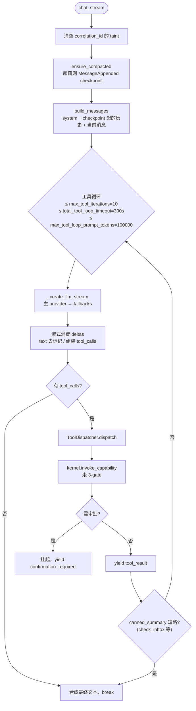

# 后端核心子系统

本文档描述后端 `backend/app/core/` 下的核心运行时子系统：Brain 推理循环、工具派发、记忆引擎、RuntimeLoop、Scheduler。API 层见 [backend-api.md](backend-api.md)，MCP 工具见 [mcp-harness.md](mcp-harness.md)。

## Brain — 推理循环

[`backend/app/core/agents/brain.py`](../../backend/app/core/agents/brain.py) 是无状态推理引擎，每个请求一个实例。核心方法 `Brain.chat_stream(conversation, user_message, system_prompt, execution_id, correlation_id)`（[`brain.py`](../../backend/app/core/agents/brain.py)）是异步生成器，产出 SSE 事件。

### 工具循环逻辑

关键实现细节：

- **会话压缩**：LLM 窗口超过 `settings.max_recent_messages`（默认 50）时，`ensure_compacted`（[`context_compaction.py`](../../backend/app/core/agents/context_compaction.py)）追加一条 `role=system` 的 `MessageAppended` checkpoint（payload.compact，经已有 `sources` 列投影为 `compact_checkpoint` 标记），而不是静默丢掉旧消息。投影表仍保留被折叠行（UI / rebuild）；扫描用 `created_at DESC` 再反转，避免 LIMIT 把最新 checkpoint 挡在窗口外。`get_history()` 只从最新 checkpoint 起读。摘要是抽取式，不另调 LLM。前端 `MessageItem` 本就会隐藏 `system` 行。
- **Markup 恢复**：若没有结构化 `delta.tool_calls` 但 `assistant_content_raw` 含 `<｜tool_calls>` 标记，`parse_tool_calls`（[`tool_markup.py`](../../backend/app/core/agents/tool_markup.py)）恢复之。
- **遥测**：`_record_llm_telemetry` 优先用 provider 报告的 `usage`（CJK 精确），缺失时回退 tiktoken。
- **Canned summary**：[`tool_postprocess.py`](../../backend/app/core/agents/tool_postprocess.py) 的 `canned_summary`（当前注册 `check_inbox` / `read_inbox_email`）可短路工具循环。
- **三个硬上限**：迭代次数、总耗时、prompt token 上限。任一触发即 `_synthesize_from_tool_results` 合成最终文本退出。

公开接口：`Brain()`、`chat_stream`、`chat`（非流式包装）。

### LLM Failover

[`backend/app/core/agents/llm_failover.py`](../../backend/app/core/agents/llm_failover.py) 是多 provider 路由：

- `LLMProvider` dataclass（`name`、`api_key`、`base_url`、`model`、`provider_type`、`is_default`、`price_per_prompt_token`、`price_per_completion_token`）。
- `LLMRouter._load_providers()` 读 `runtime_config.get_llm_config()`，过滤 `enabled=True`；若无默认则自动标记第一个。
- `get_client(provider_name)` 返回缓存的 `AsyncOpenAI`（`timeout=llm_timeout_seconds`、`max_retries=3`）。
- `get_fallback_clients()` 返回所有非默认 client。
- `_provider_available`：Ollama 只需 base_url；其他需 api_key。

Failover 执行在 `brain_llm_ops` / `brain_llm_client`（[`brain_llm_client.py`](../../backend/app/core/agents/brain_llm_client.py)）：按 `[primary, *fallbacks]` 顺序尝试，每个失败记录 `LLMCallRecord(success=False)` 遥测；全部失败抛聚合 `RuntimeError`。

### 非流式续接

`BrainLLMClient.continue_after_tool_result(conversation, depth)`（[`brain_llm_client.py`](../../backend/app/core/agents/brain_llm_client.py)）是无 checkpoint 时的 tools-free 回退。有 `chat_ckpt` 时审批后续写走 [`brain_chat_stream.py`](../../backend/app/core/agents/brain_chat_stream.py) 的 `resume_after_approved_tool`，受 `max_tool_iterations` 约束。

## ToolDispatcher — 工具派发

[`backend/app/core/agents/tool_dispatcher.py`](../../backend/app/core/agents/tool_dispatcher.py) 把工具调用批处理从 Brain 抽出。`ToolDispatcher(kernel, conversation).dispatch(tool_calls_data, correlation_id, execution_id)` 是异步迭代器，产出：

- `tool_call_start`
- `tool_result`（结果经 `compact_for_llm` 整形；超长则 [`tool_spill`](../../backend/app/core/agents/tool_spill.py) 外溢，`conversation.save_tool_result` 持久化 preview）
- `confirmation_required`（capability 状态为 pending 时，提前返回挂起）
- `done`
- `_dispatcher_done`（带 `results` 与 `tool_messages`）

## 记忆引擎

### MemoryEngine

[`backend/app/core/agents/memory_engine.py`](../../backend/app/core/agents/memory_engine.py) 管理完整记忆生命周期。记忆是**精炼洞察**（不是原始数据）。所有写经 Kernel（`MemoryDerived/Updated/Deleted`）；ChromaDB 是 Kernel 维护的派生搜索索引。

方法：`store_memory`（可选 `supersedes_memory_id` 写入 MemoryDerived payload，不扩投影表）、`search_relevant_memories`（未过滤的 Chroma 命中，仅给抽取去重）、`recall_for_context`（over-fetch + 排除 proposed/rejected/contested + 同一 supersedes 链只留最新）、`_enrich_recall_hits`（join Chroma 命中与治理投影拿 origin/confidence/category）、`format_memory_context`、`retrieve_context_string`、`list_memories`、`delete_memory`、`update_memory`。公开 `GET /api/memory/memories/search`、Chat 注入与仪表盘 `recent_memories` 走 `recall_for_context`（经 `read_ports.recall_memories_for_context`）。`GET /api/memory/memories` / `count` / `grouped` 可用已有 `source` 或 `conversation_id`（映射为 `source=conv:{id}`）过滤。Claim ratify/reject/contest 后广播既有 `memory_changed`；确认新 claim 时若 payload 含 `supersedes_memory_id`，对旧记忆发 `ClaimRejected`（历史保留）。

### MemoryExtractor

[`backend/app/core/agents/memory_extractor.py`](../../backend/app/core/agents/memory_extractor.py) 是 fire-and-forget 的自动事实抽取。`MemoryExtractor`（[`memory_extractor.py`](../../backend/app/core/agents/memory_extractor.py)）持有 `_pending_tasks` 强引用保护 CPython GC。

流程：
1. `schedule(text, source)` — 创建 asyncio task（无运行 loop 则 no-op）。
2. `_default_extract` — 若 `settings.memory_extractor == "cloud"` 走云；否则试 `local_llm.extract_memories`（Ollama），失败且有 `llm_api_key` 则回退云。
3. `extract_and_store` — 只从用户陈述提取可持久事实（助手回复仅作上下文）；每条事实经 identifier grounding、`<0.3` 置信度过滤与 `_dedup_decision`（语义召回阈值 0.85；标识符更新写入 `supersedes_memory_id` 而非丢弃）后 `memory_engine.store_memory(category="fact", actor="extractor")`。`ChatCompleted` 无用户消息时不调度抽取。

云路径用 `audit_llm_egress(messages, purpose="memory_extract")` 审计。

### 向量索引集成

Kernel 拥有 Chroma 索引。`emit_event` 对 `MEMORY_INDEX_EVENT_TYPES` 在**事务提交后**同步索引（post-commit），保证 event_log 持久化失败时不会产生孤儿向量（[`kernel.py`](../../backend/app/core/runtime/kernel/kernel.py)）。索引成功后 backfill `embedding_id`；失败进入 `memory_index_repairs` 表（上限 1000），由 [`scripts/verify_vector_consistency.py`](../../backend/scripts/verify_vector_consistency.py) 对账。

### 记忆衰减

记忆衰减逻辑内联在 [`cron_registry.py`](../../backend/app/core/runtime/cron_registry.py) 与 [`projectors_core.py`](../../backend/app/core/runtime/kernel/projectors_core.py) 的 `MemoryDecayed` 投影中：查询 `decay_eligible=True` 的记忆并发 `MemoryDecayed` 事件。由每日 03:00 的 cron 触发。召回侧 `_enrich_recall_hits` 会丢掉置信度低于 `0.3` 的命中，因此衰减会真正改变聊天上下文；Chroma 仍保留候选，由 governed 投影最终裁决。

### 本地 LLM

[`backend/app/core/agents/local_llm.py`](../../backend/app/core/agents/local_llm.py) 是 Ollama 包装，用于记忆抽取、事件分类、摘要，降低云成本。

## RuntimeLoop — 统一循环

[`backend/app/core/runtime/runtime_loop.py`](../../backend/app/core/runtime/runtime_loop.py) 是取代多个守护线程的单一 async 循环。

| Tick 频率 | 动作 |
|---|---|
| 每 tick（100ms） | 循环空闲 |
| 每 10 tick（~1s） | `_check_timers` — 扫描 `timer_events` 投影中 `fire_at <= now` 的项，emit `TimerFired`；对 cron 类型用**同一 aggregate_id** 再 emit `TimerCreated`（`INSERT OR REPLACE` 把行标回 `active`）。重启时 `_init_timers` 只跳过仍为 `active` 的具名行。 |
| 每 100 tick（~10s） | `_maintenance`（见下） |

`start()` 在进入 tick 循环之前调用 `_recover_interrupted_background_tasks`（当前尝试与半开 pending 的完整边界见 [execution-model.md](../02-concepts/execution-model.md)）。仍有未结束 handler 的 Work 留给 Scheduler。当前尝试（最新 `status=running` 之后的请求，或引起这条 running 的请求：handler 事后补写且 `caused_by` 指向它）其 handler 已失败时，仍为 running 的 Work 收成 `failed`，不重新排队，也不另开一轮 retry 预算。审批恢复先写 `ExecuteRequested`、再补 running 时，不当成没有 handler。handler 已完成且能对上同一次 `ExecuteCompleted` 时同步状态。没有 handler 行时：后台任务回到 pending；有 `executable_plan` 的 task/action 补一次 `ExecuteRequested`；goal 或没有计划则跳过。仍为 pending、最近一次状态是再次运行打开（`reason=rerun_restore`）、且其后没有 `ExecuteRequested` 的简报收回 `completed`（同一 reason）。返工把 `completed` 或 `failed` 收成 pending 时用的是 `reason=rework_restore`，不是 `rerun_restore`。这条打开之后还没有 `ExecuteRequested` 时，启动恢复把 Work 收回打开前的 `completed` 或 `failed`（同一 `rework_restore`），不把它收成普通 `completed`。这次打开若已把计划游标清进 `plan_resumes` 的 `rerun_stash:{work_id}`（再次运行和返工共用这一键），同一轮把游标放回；游标还在原行上时只丢掉暂存，不覆盖。已经发出 `ExecuteRequested` 的暂存直接丢掉，返工打开也不收回。

`_maintenance`（[`runtime_loop.py`](../../backend/app/core/runtime/runtime_loop.py)）：

1. `kernel.expire_stale_approvals`
2. `_check_reactions`
3. `_process_background_tasks` — 拉 pending `work_items(work_type=background)`，fire-and-forget `submit_command("ExecuteRequested")`
4. `_drain_memory_index_repairs`（`asyncio.to_thread`）
5. `_prune_handler_executions`（`asyncio.to_thread`）
6. `_reclaim_stale_leases`
7. `_maybe_wal_checkpoint` — 约每 60s 一次 `PRAGMA wal_checkpoint(PASSIVE)`，同样 off-loop

cron 表达式解析 `_next_cron_fire(cron_expr, from_ts)`（[`runtime_loop.py`](../../backend/app/core/runtime/runtime_loop.py)）支持 `minute=*/N`、`hour`/`minute`、`day`、`day_of_week`（名称或数字）。

## Cron 注册

[`backend/app/core/runtime/cron_registry.py`](../../backend/app/core/runtime/cron_registry.py) 定义 `SCHEDULES`（[`cron_registry.py`](../../backend/app/core/runtime/cron_registry.py)）：

| 名称 | Cron | 触发 |
|---|---|---|
| morning_brief | 每天 08:00 | `TimerFired` → `handler_name=morning_brief`。应用内通知按本地日期分桶（title `早安简报 - YYYY-MM-DD` + `dedup_key=morning_brief:{date}`），避免 `create_notification` 的 type+title 幂等把次日简报折叠进昨日同一行。通知正文含同一 `read_ports.compare_periods` 的近 7 日对比（完成目标、完成任务、新邮件、采纳率；投影缺失的完成仅在非零时写入 `work_completed_untyped`；`reason=rerun_restore` 与 `reason=rework_restore` 不计入完成）；该段读取失败时降级为「获取失败」，不中断简报 |
| deadline_alert | 每天 09:00 | `TimerFired` → `handler_name=deadline_alert`。对 1/3 天后到期的目标发 `goal_deadline` 通知；`dedup_key=deadline_alert:{goal_id}:{date}`，避免固定 title「Deadline 预警」把跨目标/跨天折叠进同一行 |
| memory_decay | 每天 03:00 | memory_decay |
| world_model_snapshot | 每周日 06:00 | world_model_snapshot |
| projection_snapshots | 每天 04:00 | projection_snapshots |
| inbox_poll | 每 15 分钟 | inbox_poll |
| inbox_digest | 每天 08:30 | inbox_digest |
| url_monitor | 每 30 分钟 | url_monitor |
| telegram_poll | 每 1 分钟 | `TimerFired` → `handler_name=telegram_poll`。后台 `poll_once`；网关未启用时返回 `disabled`，不拉更新 |

`init_scheduler()` 订阅 `WorkItemStatusChanged`。状态变为 `completed` 或 `failed` 时，只启动 `dependencies_json` 列出这一项、且依赖全部已是 `completed` 的待执行后继（`_on_work_item_status_changed`，[`cron_registry.py`](../../backend/app/core/runtime/cron_registry.py)）。没有依赖、或依赖别人的待执行任务不会因此变成 `running`。`reason=rerun_restore` 是再次运行失败后的收回，不启动后继。`reason=rework_restore` 是返工打开没有派发时的收回（`completed` 或 `failed`），同样不启动后继。失败的依赖本身不是 `completed`，所以也不会放行它的后继。

## Agent / 执行模型

### 单 Agent 模型

Runtime 使用单一持久 agent。`agent:primary` 字符串直接由 [`agent_scheduler.py`](../../backend/app/core/runtime/agent_scheduler.py) 内联使用，作为 `ensure_scheduler(kernel)` 内部的 actor 标识。所有事件路由都通过 Scheduler + `@subscribe` handler 注册机制（详见 [runtime-algebra.md](../02-concepts/runtime-algebra.md) 与 [execution-model.md](../02-concepts/execution-model.md)）。

### Event Handlers

[`backend/app/core/agents/handlers/__init__.py`](../../backend/app/core/agents/handlers/__init__.py) 在 import 时触发各 handler 模块的 `@subscribe` 注册。

Handlers（[`handlers/`](../../backend/app/core/agents/handlers/)）：

| Handler | 订阅事件 | 行为 |
|---|---|---|
| `chat_handler.py` | `ChatRequested` | 编译 prompt（`prompt_compiler`），跑 `Brain.chat_stream`，把 `text_delta`/`tool_call_start`/`tool_result` 推到 SSE 队列（不进 event_log——频率太高），emit `ChatCompleted` + `ChatDone` |
| `approve_handlers.py`（`runtime/handlers/`） | `ApproveRequested` | 解决审批；有 checkpoint 时恢复 Chat 工具环，否则 `continue_after_tool_result` |
| `execute_handlers.py`（`runtime/handlers/`） | `ExecuteRequested` | 执行 work item 的 `executable_plan`（含 `work_type=background`）。计划执行中抛出的异常把异常文本写入已有 `ExecuteCompleted.error` 后正常返回，不再写成字面量 `handler_failed`。工具步骤返回 failed 或 denied 时，步骤结果里已有的失败原因同样写入该字段；空白原因不写。`continue_on_error` 之后计划仍完成的，不写 `error`。简报编译失败仍优先用编译错误文本 |
| `inbox_poll_handlers.py`（`runtime/handlers/`） | `InboxPollRequested` | 经 capability 拉未读邮件 |
| `timer_trigger_handler.py` | `TimerFired` | 按 `handler_name` 分派：`deadline_alert`、`memory_decay`、`world_model_snapshot`、`projection_snapshots`、`inbox_poll`、`inbox_digest`、`morning_brief`、`reminder`、`url_monitor`、`telegram_poll`。`inbox_poll` 发出 `InboxPollRequested` 后返回，不在这条定时 Work 里等待完成。`url_monitor` 与 `telegram_poll` 用 `asyncio.create_task` 放到后台，避免 30s ExecutionPolicy 超时。`reminder` 只在 payload 里已有非空 `work_id` 且任务仍在时再次运行或打开这一份任务；执行请求失败时收回 `completed`（`reason=rerun_restore`），不留下半开的 pending，也不把别的待执行任务标成 `running`。任务已删除、该键为空白，或没有该键时仍是普通提醒，不改去读 `action_id`。不新建任务、不为这次触发另建交付 |

## Scheduler — WorkItem 执行引擎

[`backend/app/core/runtime/agent_scheduler.py`](../../backend/app/core/runtime/agent_scheduler.py) 是 WorkItem 执行引擎。

- `__init__` 调 `_recover()` 扫描中断的 `handler_executions`。`retry_count` 未达 `max_retries` 时重放为 `ExecutionRetried(reason=interrupted)`（先 `retrying` 再 `pending`，`retry_count` +1）。预算已尽则与 `_maybe_retry` 超限相同：`ExecutionFailed`（`error=interrupted`，`terminal` + `dead_letter`），不再重放。
- 循环每 50ms tick，每 tick 处理至多 `_MAX_CONCURRENT=8` 个 item。
- `enqueue(instance_id, actor, event, policy)` → 查 handler → 创建 ScheduledExecution → emit `ExecutionRequested`。
- `_process_work_item` 在 `execution_scope(item.id)` 内跑 handler，使能力调用正确归属。
- `_emit_verify` 每次写后跑 `verify_persist_matches_projection`（影子比对）。`dead_letter` 置位后调用 `close_dead_lettered_domain_work`：该死信属于当前尝试的 `ExecuteRequested`（最新 `status=running` 之后，或 handler 事后补写 running 且 `caused_by` 指向该请求），且该请求的 handler 都已终态、至少一条失败时，把仍为 running 的领域 Work 收成 `failed`（`WorkItemStatusChanged`），不另开 retry 预算。更早一次请求不收口后来的 running。
- `kernel.expire_stale_running_leases` 是不取消在途任务、也不把剩余重试重新入队的薄事件路径。这次调用里过期的行都写成 `ExecutionFailed` 之后，终态死信走同一个收口函数；仍有未结束的 sibling handler 时不收口。RuntimeLoop 维护周期仍调用 `Scheduler.reclaim_stale_leases`。
- `replay_dead_letters` 把死信重新排成 pending 之前先读 `work_items`。状态已是 `failed`、`completed` 或 `cancelled` 时跳过（`work_terminal:<status>`），不发 `ExecutionRetried`。死信不属于当前尝试时也跳过（`not_current_attempt`）。handler 事后补写 running 且 `caused_by` 指向该请求时，这一条仍是当前尝试。没有领域 Work 的执行（例如 `TimerFired`）仍重放。Work 仍为 running 且死信就是当前这次请求时，重放行为不变。
- 默认 `ExecutionPolicy(timeout=30s, max_retries=3, retry_delay=5s)`；`ChatRequested` 由 `policy_for_event` 覆盖为工具环超时 + `max_retries=2`（第三次崩溃仍 DLQ，见 [ADR-R011](../07-adr/ADR-R011-chat-approval-continuation.md)）。
- `get_scheduler(kernel)` 是单例工厂。

### ScheduledExecution 与 ExecutionContext

- [`scheduled_execution.py`](../../backend/app/core/runtime/scheduled_execution.py) — Lane A 原子执行单元，状态机 `pending → running → completed | failed → retrying → running`，持久化于 `handler_executions`。`to_row`/`from_row` 用于序列化。
- [`execution.py`](../../backend/app/core/runtime/execution.py) — 最小 handler 上下文（`instance_id`、`actor`、`correlation_id`、`_kernel`、`principal`、`execution_id`），暴露 `emit()`。
- [`handler_registry.py`](../../backend/app/core/runtime/handler_registry.py) — 事件类型 → async handler 映射，`@subscribe("EventType")` 装饰器注册。
- 影子比对（Execution 契约 §2）内联在 [`agent_scheduler.py`](../../backend/app/core/runtime/agent_scheduler.py) 的 `_emit_verify` → `_shadow_compare`：每次 emit 后比对 `ScheduledExecution.to_row()` 与 `handler_executions` 投影。

### SSE 队列

[`backend/app/core/runtime/notification_bridge.py`](../../backend/app/core/runtime/notification_bridge.py) — 每个 `correlation_id` 一个内存 `asyncio.Queue`，用于聊天流式。避免每个 turn 在 event_log 写入数百条 `ChatTextDelta`。

## 异步派发器

Scheduler 通过 `kernel.set_async_dispatcher()`（[`kernel.py`](../../backend/app/core/runtime/kernel/kernel.py)）注册一个 fire-and-forget 派发器：`emit_event` 事务提交后，每个事件被投递给 [`agent_scheduler.py`](../../backend/app/core/runtime/agent_scheduler.py) 的 `_dispatch_to_scheduler`。后者用 [`handler_registry.get_handler(event.type)`](../../backend/app/core/runtime/handler_registry.py) 查表——匹配则 `enqueue` 一个 ScheduledExecution 给 Scheduler 执行（`pending → running → completed`，持久化于 `handler_executions` 以支持崩溃恢复），不匹配则跳过。event_log 是唯一真相，派发器只是其上的内存路由层。

## 其他核心组件

| 文件 | 职责 |
|---|---|
| [`work_item_engine.py`](../../backend/app/core/runtime/work_item_engine.py) | WorkItem CRUD 模块函数（`work_type=task`，底层 emit `WorkItem*` 事件）；统一状态机（`WorkItemStatus` 枚举 + `_TRANSITIONS` 校验） |
| [`runtime_config.py`](../../backend/app/core/runtime/runtime_config.py) | LLM/Email 设置持久化于 SQLite `app_settings`；env 播种默认；UI 编辑持久化 DB；若存在 `runtime_config.json` 则自动导入 `app_settings`。`PROVIDER_TYPES`、`PROVIDER_PRESETS`、`effective_api_key`、`get_llm_config(masked)`、`update_llm_config`、`get_email_config`、`get_generation_params`、`get_prompt`/`save_prompt` |
| [`cron_registry.py`](../../backend/app/core/runtime/cron_registry.py) | Cron 调度注册（扫描在 RuntimeLoop）：`ensure_schedules`/`create_schedule`/`list_schedules`/`delete_schedule` |
| [`reaction_registry.py`](../../backend/app/core/runtime/reaction_registry.py) | 声明式触发器注册 |
| [`runtime_loop.py`](../../backend/app/core/runtime/runtime_loop.py) | 后台任务生命周期与轮询（`background_worker` 折叠于此）：timer 扫描（每 10 tick）、维护（每 100 tick）、后台任务派发、ChromaDB repair 重试 |
| [`notification_channel.py`](../../backend/app/core/runtime/notification_channel.py) | 可插拔通道：`DesktopChannel`（WS 广播）、`WebhookChannel`（HTTP POST）、`NtfyChannel`（ntfy.sh）。`NotificationRouter.notify()` 扇出 |
| [`notification_bridge.py`](../../backend/app/core/runtime/notification_bridge.py) | 同步→异步桥；`push_notification` 持久化+广播，`broadcast_event` 纯传输 |
| [`telemetry/telemetry.py`](../../backend/app/core/telemetry/telemetry.py) | 记录每次 LLM 调用（`LLMCallRecord`）与工具调用（`ToolCallRecord`）到 `llm_calls`/`tool_calls` 表 |
| [`world_model.py`](../../backend/app/core/agents/world_model.py) | 30 天滚动生活快照（活跃目标、近期完成、近期活动类型），并附上近 7 日与前 7 日对比（提示词行只写完成目标、完成任务、新邮件、采纳率，来自 `read_ports.compare_periods`；`rerun_restore` 与 `rework_restore` 不计入完成，不落新表）。缓存；周 cron 刷新 |
| [`user_profile.py`](../../backend/app/core/agents/user_profile.py) | 结构化画像（偏好/价值观/关系/健康/财务/职业），置信度评分、30 天时间衰减、冲突解决。经 `UserProfileUpdated` 事件写 |
| [`startup_health.py`](../../backend/app/core/startup_health.py) | `run_startup_checks()` 校验存储路径、LLM 配置、认证、邮件。`enrich_with_mcp_status`、`sanitize_startup_for_public` |
| [`rate_limit.py`](../../backend/app/core/rate_limit.py) | 内存令牌桶（按端点前缀）：`/api/chat` 30/60s、`/api/settings/llm/test` 5/60s、`/api/settings/email/test` 5/60s、`/api/inbox/poll` 10/60s、`/api/system/export` 3/60s |
| [`logging_config.py`](../../backend/app/core/logging_config.py) | structlog + stdlib；`_request_id_processor` 把 `request_id_var` 附到每行日志 |
